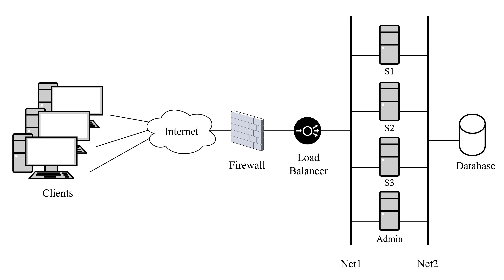

# Automatic Deployment of Scalable Application on OpenStack with Terraform

[](https://www.terraform.io/) [](https://www.openstack.org/)

Automate your scalable application deployment on OpenStack with Terraform! ☁️ Infrastructure as Code made easy.

## 📝 Description

This project leverages Terraform to automate the deployment of a scalable application on OpenStack. It sets up a robust environment with web servers, a database, load balancers, and firewalls, allowing you to deploy your application with ease.

## ✨ Features

* **Fully Automated Deployment:** Deploy your application on OpenStack with just a few commands.
* **Modular Infrastructure:** Well-organized Terraform files for easy management and customization.
* **Advanced Networking:** Configuration of multiple subnets and security rules for optimal network security.
* **Load Balancing:** Utilizes OpenStack LBaaS (Octavia) for efficient traffic distribution.
* **Custom Firewall:** Implements OpenStack FWaaS for enhanced security.
* **Dynamic Scaling:** Easily scale your web servers based on demand.

## 🏗️ Project Architecture

The application environment consists of:

* 🌐 **Web Servers:** Three Nginx web servers for serving your application.
* 💾 **Database:** A dedicated database instance.
* 💻 **Administration Server:** SSH access for management.
* ⚖️ **Load Balancer:** Distributes traffic evenly across web servers.
* 🛡️ **Firewall:** Restricts unauthorized access.



## 📋 Requirements

Before you begin, ensure you have the following:

* OpenStack account with administrative access (version >= 1.53.0).
* Correctly configured OpenStack credentials.
* Terraform installed (version >= 0.14.0).

## 🚀 Installation and Usage

1.  **Clone the Repository:**

    ```sh
    git clone [https://github.com/Alejandro-Fdez-Gon/terraform-openstack-network.git](https://github.com/Alejandro-Fdez-Gon/terraform-openstack-network.git)
    cd terraform-openstack-network
    ```

2.  **Initialize Terraform:**

    ```sh
    terraform init
    ```

3.  **Preview Changes:**

    ```sh
    terraform plan
    ```

4.  **Apply Configuration:**

    ```sh
    terraform apply
    ```

    To customize variables, modify `terraform.tfvars` or use command-line flags:

    ```sh
    terraform apply -var="num_servers=6"
    ```

5.  **Destroy Environment:**

    ```sh
    terraform destroy
    ```

To use variables with values other than the defaults, modify the `terraform.tfvars` file or directly via the command line. Example command-line usage for the variable associated with the number of servers:

  ```sh
  terraform apply -var="num_servers=6" 
  ```

4. To destroy the environment:
  
  ```sh
  terraform destroy
  ```
---

🎓 This project was developed as the final project for the Cloud Computing, Network Virtualization, and Services course within the Master's Degree in Telecommunication Engineering.
